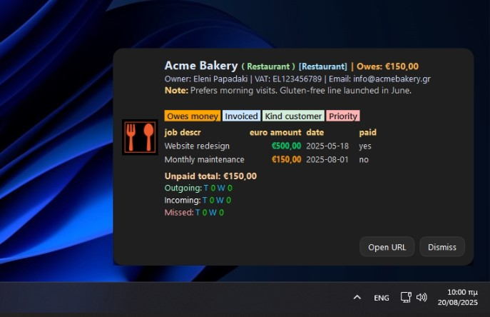
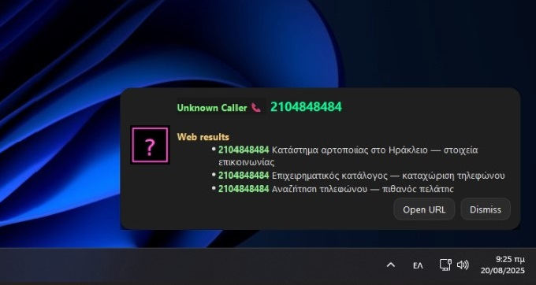

# MicroSIP Caller Toast

A small always-on-top toast for MicroSIP incoming calls. Resolves the number against a demo in-memory DB and displays the caller profile, unpaid services, and recent call stats. If the number is unknown, it shows three mock “web results” and saves them to a CSV. Runs offline, no real DB or network calls.

---

## Screenshots

**Known number:**  


**Unknown number:**  


---

## Program Avatars

The toast supports **sector-specific avatar icons**. These change automatically based on the caller’s program/sector.  
Place these in the same folder as the script:

- `Retail.png`
- `Energy.png`
- `Restaurant.png`
- `unknown.png`

| Retail.png | Energy.png |
|------------|------------|
|  |  |

| Restaurant.png | unknown.png |
|----------------|-------------|
|  |  |


## Features

- **Known caller**
  - Business profile: name, program, sector, VAT, email, owner.
  - Notes field (sanitized + truncated).
  - Colored label “chips” (Owes money, Invoiced, etc).
  - Services table with amounts (green if paid, orange if unpaid).
  - Footer: unpaid total + call statistics (today/week).

- **Unknown caller**
  - “Unknown Caller” pill + phone number styled in bold lightgreen.
  - Web results list (mocked, phone highlighted even with spaces/dashes).
  - Logged into `unknown_calls.csv` with timestamp + results.

- **Call stats**
  - Parses `microsip.ini` `[Calls]` section (if present).
  - Tracks today / last 7 days per direction (Outgoing / Incoming / Missed).
  - Status tallies (Answered, Busy, Canceled, Forbidden, Other).

- **UI styling**
  - Dark theme card with shadow and rounded corners.
  - Bottom-right positioning on Windows.
  - Auto-dismiss after configurable timeout (default 10s).
  - Buttons: `Open URL` (launches configured link), `Dismiss`.

- **Logging & persistence**
  - Logs to `debug.log`.
  - Writes unknown numbers and mock search results to `unknown_calls.csv`.

---

## Install

```cmd
py -3 -m venv .venv
.venv\Scripts\activate
pip install PySide6>=6.6
```

---

## Run

```cmd
python microsip_caller_toast_demo.py
```

Configurable constants:
- `PHONE` (target number)
- `INI_PATH` (path to MicroSIP ini, optional)
- `TIMEOUT_MS` (auto-close ms)
- `IMG_BY_PROGRAM` / `IMG_UNKNOWN` (avatars)

---

## License

MIT (suggested). Add LICENSE to repo.
